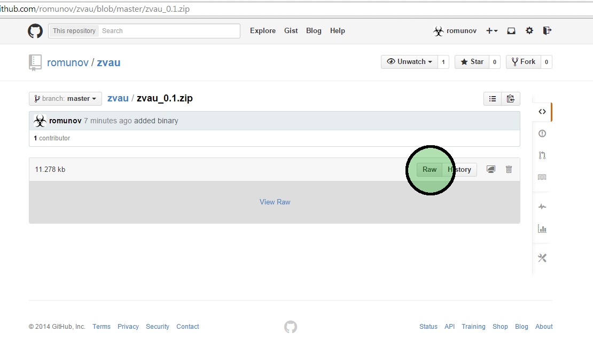

A bundle of functions we use in our daily routine here at the Ecology group (Department of biology, Biotechnical faculty, University of Ljubljana).

The package currently contains the following functions:

* `readClumpp` Read result of Clumpp into a `data.frame`
* `writeStructure` Write a `genind` object to be analyzed using Structure
* `writeGenePop` Write two `genind` objects to be analyzed using GENEPOP
* `writeGenPop` Write a `genind` object to be analyzed using GENEPOP using `strat`/`pop` functionality. It can also write a list of genind objects as populations.
* `subsetGenData` Handle dropping levels in `other` slot
* `writeINEST` Will write INEST file from a `genind` object
* `drawLoci` Will draw alleles from a list of loci
* `findIntegerInterval` Find a repeating sequence of integers
* `findSeason` For a datum, find a season based on equinox/solstice
* `plotCircleOnMap` Will plot circles on a map based for a given variable and its SE
* `Mratio` Calculate Garza-Williamson M-ratio.

### Package installation
#### The easy way via `devtools`

To install the package using

```r
library(devtools)
install_github("romunov/zvau")
```

you will need

* R
* Rtools (see [http://cran.r-project.org/bin/windows/Rtools/](http://cran.r-project.org/bin/windows/Rtools/)) to build the package
* LaTeX ([MiKTeX](http://miktex.org/download) on Windows) to build documentation.

#### Via binary package
To install from a binary package, you can download the .zip file (may not be up to date!) by clicking Raw and saving it to a (known) location.



After you have a local copy, you can install the package from within R using

```r
install.packages("zvau_*.zip", repos = NULL) # change filename according to the version
```